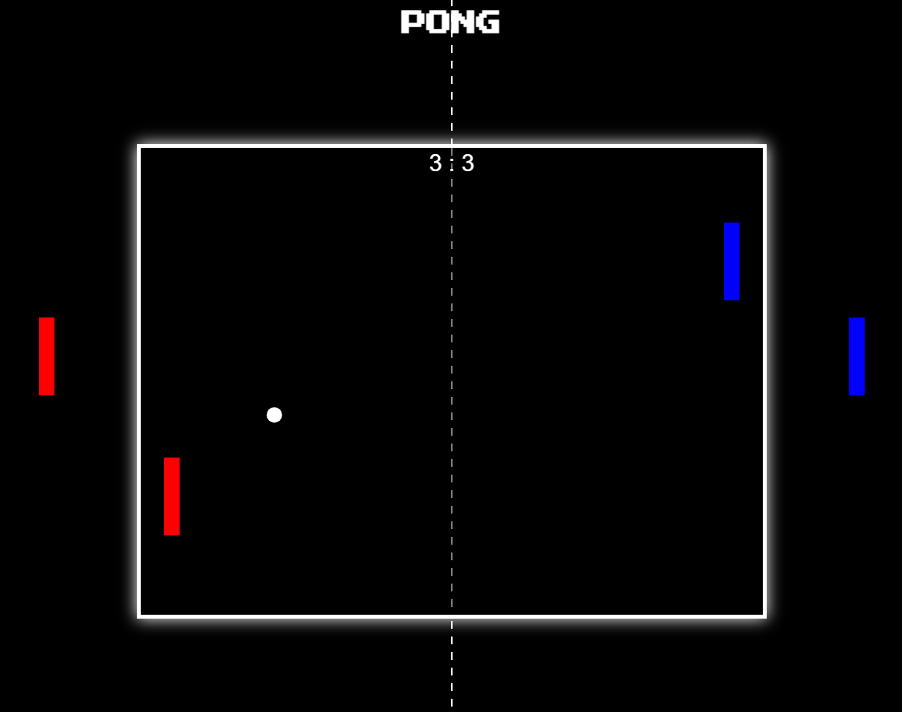

# PongJS

Proyecto universitario donde creo el videojuego PONG utilizando únicamente HTML, CSS y JavaScript. No se utilizan librerías externas, el motor es creado desde 0.

## Cómo ejecutar

Para iniciar una partida se puede acceder al pages del repositorio o descargar el código y ejecutar el index.html. ¡Disfrute!

## Previsualización

